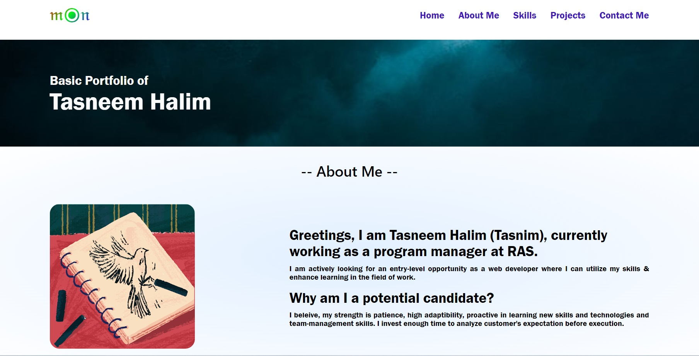

# TH-basic-portfolio

## Description

This is the "Advanced CSS" homework for the coding boodcamp. 
- My motivation was to learn HTML and CSS better. And doing this project helped me a lot!
- I always wanted to have my own portfolio. As a Computer Science teacher, I always helped my students to build their portfolio but never tried my own in recent years.
- This project helped me to learn more about how to design a website better. I have learnt tons of things regarding "Web designing".
- Apart from basic HTML and CSS, I learnet how to inspect a website, how inspect can help in debugging, how web designs can vary a lot by just changing margin, padding, border change etc. Over all, working on thi sproject was very helpful in my learning.

## Table of Contents (Optional)

If your README is long, add a table of contents to make it easy for users to find what they need.

- [Installation](#installation)
- [Usage](#usage)
- [Credits](#credits)
- [License](#license)

## Installation

All the installations where there as I already did it last week for Challenge #1. Mostly used chrome dev tools, VScode, Git bash, Githib and tons of analytical and mathematical skills.

## Usage

Please go to this link to view my Potfolio-website : https://thalim-glam.github.io/TH-basic-portfolio/

Here is a sample screenshot showing partial view og my project

## Comand line code

I used a lot of git commands like :
git status
git add -A
git commit -m "Comment goes here"
git branch
git push
git pull origin main
git checkout main
git checkout -b feature/add-branch

## Credits

Apart from me :D the credit also goes to my Instructor, TAs, Tutor, Classmates, and GOOGLE (my best buddy to help whenever I got stuck in anything!)

## License

MIT Lisence
---

## Badges

## Features

In my code I had 1 main branch and crated a few featured branch to test my code and update.
  - For html code please see index.html file
  - For Desktop version please see style.css file
  - For tablet version please see tablet.css file
  - For mobile version please see mobile.css file

## How to Contribute

I followed this https://coding-boot-camp.github.io/full-stack/github/professional-readme-guide as my guidelines to how to write a README file.

## Tests

How to test the code? 
  - Please go to inspect and see html and css files
  - For html code please see index.html file
  - For Desktop version please see style.css file
  - For tablet version please see tablet.css file
  - For mobile version please see mobile.css file
Personally I used VSCode as an IDE to edit code.
For browser, I tested in Google Chrome.
To inspect my code, I used Google Chrome Development tool.
